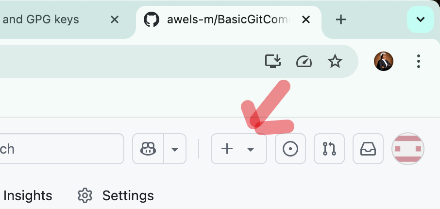
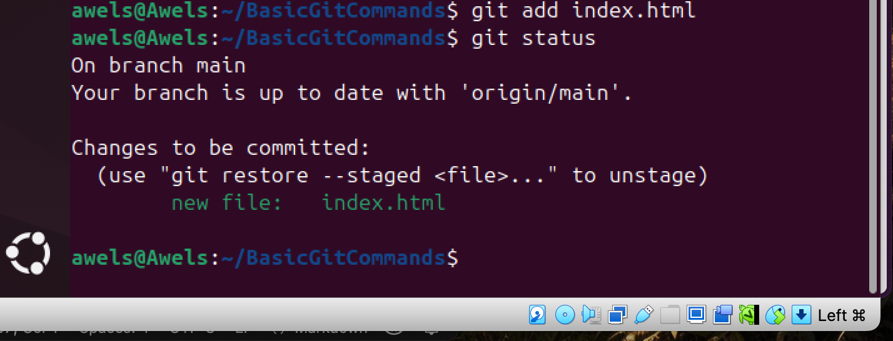
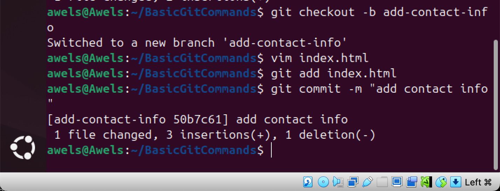

# BasicGitCommands
Here I will be submiting my project on basic git commands

# Project Overview
This is a project that helped me to gain mastery on the basic git commands and how to apply them successfully. this project introduced me to git version control and markdown. i was able to explore essentials tools for software development and collaborative writing. 

# PURPOSE 
1. This project aims at helping me gain mastery on the basic git commands
2. This project also aims at helping me understand how to apply them successfully
3. This project introduced me to git version control 
4. This project aims at promoting collaborative writing

# OBJECTIVE
The objective of this project is to help me understand the basic gits commands and know how to apply then successfully. i also learnt git version control and markdown. the objective was also to give me the chance to explore essential tools for software development and also promote collaborative writing.

# THE PRACTICAL PROCESS
the first step is to create a repository and this is done by using the git hub website. the image below depicts this. 

the next step is to create the repository. write the name of the new repository and the description of what the repository would be all about. 
the image below depicts that.

after which the repository has been successfully created and the next thing is to clone it on my terminsl. to clone it successfully, i would have to copy the link of the reposity from the git hub website. the image below depicts this. 

after copying the link, the next thing is to go to my terminal and run this command 
'git clobne' and the link. the image below depicts this. 

the next thing to do is to enter into the repository on my terminal. the image below depicts that. 

the next thing to do is to create a file called 'index.html'
after which i am to write a content into the file. to create the file i will be using 'vim'.
hence, the command would be 'vim index.html'

the next thing to do is to check stages that has not been staged and this is done using the command 'git status'
the image below depicts this. 

now it is obvious that i need to add the file and this is done by using this command 'git add index.html'
the image below depicts this.

the next thing to do is to confirm the current status and this is done by using the command 'git status' 
the image below depicts this.

the next thing to do is to commit the changes and this is done by running the command 'git commit -m' and the comment next to it. 
the image below depicts this 

the next thing is to push the changes to the main branch and this is done by using this commands 'git push origin main'. the image below depicts that

the next thing on the task list is to check the current branch that i am working on and this is done by running this command 'git branch'. the image below depicts this. 

the next thing to create a new branch for Tom. the name of the branch is 'update-navigation' and this is done by running this command 'git checkout -b update-navigation'. the image below depicts this 

the next thing is to comfirm the new branch i am working on and this is done by using the command 'git branch'. the image below depicts this.

this is a further comfirmation that i am on the newly created branch. the next thing to so is to enter into the file that i earlier created on the main branch as this would also exist on the newly created branch due. the image below depicts this. 

the next thing to do is to add the neccessary changes on the file and save it. the image below depicts this. 

after saving the file, the next thing to do is check the git status, add the changes and then check the git status again to confim it has been successfully added. the commands to use are:
1. git status
2. git add index.html
3. git status

the images below depicts this. 

the next thing to do is to commit the changes and then push toms branch to github main branch. this is done by running the commands below 
1. git commit -m "update-navigation bar"
2. git push origin update-navigation

the image below depicts this.

# JERRYS WORK 
working on Jerrys part, the first thing to do switch back to the main branch, pull the latest changes and create a new branch for Jerry. the commands to use are below;
1. git checkout main
2. git pull origin update-navigation
3. git checkout -b add-contact-info

the name of the branch for Jerry is 'add-contact-info'. the image below depicts this:

the next is to open the index.html file and make Jerrys changes, stage (add) Jerry's changes and then commit the changes. the command used for this is below:
1. vim index.html
2. git add index.html

3. git commit -m "add contact info"

the images below depicts these

the images above shows that the jerry has made his contribution on the index.html and has saved the file. Jerry has also staged the changes and commited the changes with a comment. 

the next thing to do is push Jerry's branch to Github. this is done by using the command 'git push origin add-contact-info'

the image below depicts this

# CONCLUSION 
i was able to run this task successful anf gained master in basic git commands and how to apply them successfully. i was able to clone repositories and create files as well as edit them from different branches and merge them successfully. 